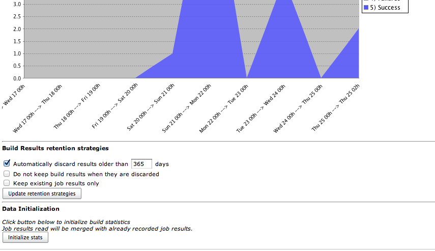

# Jenkins : Global Build Stats Plugin

Global build stats plugin will allow to gather and display global build result statistics.  
It is a useful tool allowing to display global jenkins/hudson build trend over time.

## Usage

The global build stats main screen is made of different sections :

*   On the left side : Action links
*   On the center : Charts displaying global build statistics & action buttons (update, move & delete)
*   On the bottom : Data initialization  
    

## Action links

4 links are availables :

*   Back to dashboard : Navigation link allowing to go back to Jenkins/Hudson root URL
*   Create new chart : Display a popup form to create a new Chart. See the [Create / Update a chart section](#build-stats-chart-creation--update).
*   Manage retention strategies. See the [Manage retention strategies section](#manage-retention-strategies).
*   Data Initialization : Useful to initialize your global build stats data, especially just after Global build stats first installation. See the [Data Initialization Section](#data-initialization).

## Data Initialization

If you click on this button, all of your existing persisted build results will be gathered.  
This is particularly useful to initialize statistics in a first step.  
Note that data initialization gathering is only based on "recordable" data. If you frequently purged your job results, data will no longer be available for gathering. Nevertheless, once data has been initialized in global-build-stats, it will be made available even if data is purged (result data is cloned in the global-build-stats.xml file).  
Starting from 0.1 (and greater ones), you can perform several data initializations : existing global-build-stats.xml will be merged against eventually new gathered data.

<u>Take into account the following only if you are using a 0.1-alphaX version of global-build-stats plugin (for greater versions, data are merged and thus, never lost) :</u>  
<u>**Beware**</u> : this should be done only once because :

*   Statistics are automatically updated after each build
*   "not recoverable" statistics (for example, if you check the "delete old builds" checkbox on job configuration) will be lost if you click this button

## Manage retention strategies

This section is for customizing job build result retention for global-build-stats plugin.  
Job build result is the largest data stored in global build stats configuration files (in global-build-stats.xml or global-build-stats/jobResults/\*). That is to say, if you're expecting some disk consumption issue, a workaround would be to be stricter on the job build result retention strategies.

⚠ Warning

Using retention strategies will delete **permanently** job build results. Thus, you won't be able to retrieve them.  
Take this functionality with care.

Prior to version 1.2, 3 retention strategies are available :

*   Automatically discard results older than X days : as mentioned, by checking this strategy, a daily purge process will be executed to clean oldy job build results stored
*   Keep existing job results only : by checking this strategy, a purge will be triggered **only once** (when submitting the form) that will ensure every global-build-stats stored build results correspond to an **existing** (ie not purged) build result.
*   Do not keep build results when they are discarded : by checking this strategy, every time someone will delete a build or a job, corresponding job results stored by global build stats will be deleted. This strategy is different than "keep existing job result only" strategy since it won't affect job results stored in the past. Moreover, it is a strategy that will be triggered regularly (instead of only once for "keep existing job results only").

## Build stats Chart Creation / Update

In this popup form, you can create a new Build Stats Chart.  

Here are some details on the different parameters :

*   Chart title : Title displayed on top of the Chart
*   Chart size : Width & Height (in pixels) of the created chart
*   Chart Scale : Unit of chart X axis. Either Year, Month, Week, Day or Hour. Difference between "XXX" and "XXX From now" concerns the X axis ranges. If current datetime is 2010/10/27 3:00 PM and selected chart scale is "daily", last date ranges on X axis will be \[ 2010/10/26 00:00 AM -> 2010/10/27 00:00 AM \] and \[ 2010/10/27 00:00 AM -> 2010/10/27 3:00 PM \]. If "daily from now" were selected, we would have \[ 2010/10/25 3:00 PM -> 2010/10/26 3:00 PM \] and \[ 2010/10/26 3:00 PM -> 2010/10/27 3:00 PM \]
*   Chart Length : Number of steps (ticks) on X axis. Unit used depends on selected chart scale.
*   Job filtering : Either All jobs (no filtering) or a job name regex (syntax is the same than the one used by [Pattern class](http://docs.oracle.com/javase/7/docs/api/java/util/regex/Pattern.html)
*   Node filtering : Either All nodes (no filtering), master node, or a node name regex (syntax is the same than the one used by [Pattern class](http://docs.oracle.com/javase/7/docs/api/java/util/regex/Pattern.html)
*   Launcher filtering : Filtering on user who launched the build. System user is used when performing triggered non manual builds, so if you want to display "automatic" (=non manual) builds, check the "System only" radio button. The user name regex syntax is the same than the one used by [Pattern class](http://docs.oracle.com/javase/7/docs/api/java/util/regex/Pattern.html)
*   Statuses filtering : Success, Failures, Unstables, Aborted or Not Build builds. Not that "not build" statuses are unchecked by default : this status is special since sometimes, on a successful maven multi module project, module builds are marked as "not build" (unknown reason)
*   Elements displayed on chart. I call these elements "dimensions" :
    *   Build statuses : will show build count (or percentage) for each selected build statuses
    *   Total build time : will display total cumulated build time on each time ranges. This functionality could be useful to determine the cost of an externalization in a "Jenkins/Hudson as a Service" platform like [cloudbees](http://www.cloudbees.com/)
    *   Average build time : will display average cumulated build time on each time ranges

All fields are mandatory. Chart's width, height & length should be integers.  
**If at least 1 server-side validation fails, form will not be "submittable".**

Before submitting the form, you can have a look at the future chart which will be displayed by clicking the "overview" button.

## Build stats Chart display

This section displays every persisted Chart Configurations.  
You can, too, edit, delete or move up/down these graphs.  
Graphs are created using REST-like URL so that you can export this URLs into your favourite Portal or CMS (or Jenkins/Hudson dashboard).  
2 chart examples can be seen below :  
  

Last chart displays the 3 available dimensions altogether (result counts, total build time & average build time).

By clicking a results counts region, you will be redirected on the build search engine screen.  
See the Build Search engine section for further details.

Near every build chart, you'll have at least two button : edit & delete buttons.  
Depending of the placement of your chart, you'll be able to "move up/down" the chart.

#### Notes about user & node filtering

⚠ Warning

Don't expect to have relevant results just after an upgrade between :

*   pre and post 0.4 versions for node filtering
*   pre and post 1.0 versions for user filtering

When migrating, only not purged data (concerning node & user having launched the build) will be recorded.  
That is, "old" data (such as builds executed a few weeks ago) won't be available.

Starting from your plugin upgrade, full data will obviously be recorded.

#### Notes about durations displayed when migrating to v0.5

⚠ Warning

For the same reasons as above, don't expect to have relevant results just after an upgrade between pre and post 0.5 versions : you'll have to wait a few times in order to have sufficient data amount to calculate total & average build duration.

## Build search engine

The build search engine is accessible by clicking a build result region on a chart.  
It will provide search criteria to query the global-build-stats build results on different ways : result status, job name, node name and date ranges.  

Result sort order can be changed by clicking the table headers.  
If build result has not been purged, a clickable link will be displayed to navigate through the console output & the detailed build result.

## Bonus track : Global-build-stats JSON API

A detailed section has been created to describe [how to retrieve global-build-stats data from Jenkins/Hudson standard JSON & REST API](docs/rest_api.md).

## Product backlog

### Future version(s)

Identified issues :  
[JENKINS-7241](https://issues.jenkins-ci.org/browse/JENKINS-7241): Special characters in chart title ("é" for example) are not well filling textfields in edit form  
Fix legend item sorting (for now, sort depends on alphabetical order... that's why statuses are prefixed with "1), 2).."  
Fix date displayed on build search view, due to yui calendars  
Rename persisted node names in global-build-stats.xml after node is renamed

Features :  
Test global build stat behaviour under IE & Safari  
Cache chart renderings (provide a checkbox in the buildStatConfiguration, allowing to enable chart caching with a given refresh rate based on selected time scale). Chart rendering will cache chart in-memory (thus it will consume a little bit more memory) but will reduce the CPU used when displaying the chart. It feets particularly well if you decide to "share" your chart with lots of users that will want to display it (on the jenkins/hudson welcome screen for example)  
In build search results, allow to limit number of results (radio button allowing "unlimited" and "limited to XXX results")  
Allow to select build start or build end for stats gathering (build end could be calculated with build start + duration). For now, we use only build start  
(if possible) Allow to click on a date to display date builds (no matter the build result)  
If possible, provide tooltips on chart, displaying the 10 first job names matching with the current hovered region
