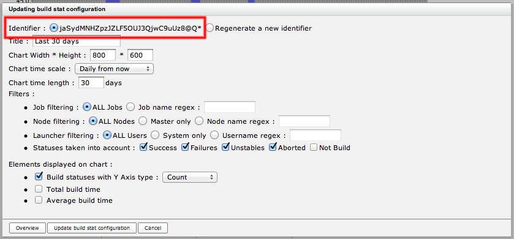

# Jenkins : Global Build Stats Plugin - JSON & REST APIs

This wiki entry is intended to describe [global-build-stats](../README.md) REST API to manually gather informations about your jenkins build statistics.

## Build stats chart

You can retrieve chart depending on its id, by requesting the following URL : <jenkins/hudson\_url>/plugin/global-build-stats/showChart?buildStatId=**\<Chart id>**

**\<Chart id>** can be retrieved on the "edit chart" screen (see below).



<u>By providing a chart id, no permission checking will be performed against current logged user.</u>  
That's why it represents a perfect use case to share global build stats chart url between team members / managers.  
But beware : if, in the "edit chart" screen, you re-generate a new chart id, "old" url won't display anything (typically, useful to "rollback" the diffusion of chart url)

## Build stats chart overview

You can dynamically generate a new chart, by requesting the following URL : <jenkins/hudson\_url>/plugin/global-build-stats/createChart?title=**\<chart title>**&buildStatWidth=**\<chart width>**&buildStatHeight=**\<chart height>**&historicScale=**\<chart scale>**&historicLength=**\<chart length depending on historicScale>**&jobFilter=**\<job filtering>**&nodeFilter=**\<node filtering>**&launcherFilter=**\<launcher filtering>**&successShown=**<displays successes ?>**&failuresShown=**<displays failures ?>**&unstablesShown=**<displays unstables ?>**&abortedShown=**<displays aborted builds ?>**&notBuildsShown=**\<displays not builds>**&buildStatusesShown=**<displays build statuses ?>**&yAxisChartType=**\<type of y axis fod build status>**&totalBuildTimeShown=**<displays total build time ?>**&averageBuildTimeShown=**<displays average build time ?>**

Only Jenkins/Hudson <u>**ADMINISTRATORS**</u> will have access to this url (this url is typically used for chart overview). If you don't want to check permissions, use the previous URL.

Detailed values for different fields are given here :

*   buildStatWidth & buildStatHeight : should be number of pixels
*   historicScale : should be an item in { HOURLY, HOURLY\_FROM\_NOW, DAILY, DAILY\_FROM\_NOW, WEEKLY, WEEKLY\_FROM\_NOW, MONTHLY, MONTHLY\_FROM\_NOW, YEARLY, YEARLY\_FROM\_NOW }
*   historicLength : should be a number of steps in _historicScale_. For example, if historicScale is equal to DAILY, historicLenght will corresponds to "number of DAYS"
*   jobFilter : should be equal to ALL _or_ fieldRegex(**_regex for job name_**)
*   nodeFilter : should be equal to ALL _or_ fieldRegex(**_regex for node name_**). Special node regex ^master$ can be used to filter only on jobs executed on the master.
*   launcherFilter : should be equal to ALL _or_ fieldRegex(**_regex for user name who launched the build_**). Special launcher regex ^SYSTEM$ can be used to filter only on jobs that has been launched _automatically_ by jenkins/hudson.
*   successShown, failuresShown, unstablesShown, abortedShown, notBuildsShown, buildStatusesShown, totalBuildTimeShown, averageBuildTimeShown : should be booleans
*   yAxisChartType : is only used if buildStatusesShown=true. Should be an item in { COUNT, PERCENTAGE }

## Build stats chart configuration data

You can retrieve persisted build stat chart configuration by requesting the following URL : <jenkins/hudson\_url>/plugin/global-build-stats/api/json?depth=2

Here is some data sample returned by this call :

```javascript
"buildStatConfigs":
[
  {
    "id":"gdJTZ1t!vf6nvnLZcyctEY4495xkn0ep",
    "buildStatTitle":"Commits build des 15 derniers jours (pas de rouge !!)",
    "buildStatWidth":800,
    "buildStatHeight":600,
    "historicLength":15,
    "historicScale":"DAILY_FROM_NOW",
    "dimensionsShown": ["BUILD_COUNTER","BUILD_TOTAL_DURATION","BUILD_AVERAGE_DURATION"],
    "averageBuildTimeShown":true,
    "buildStatusesShown":true,
    "yAxisChartType":"COUNT"
    "totalBuildTimeShown":true,
    "buildFilters":
    {
      "jobFilter":"fieldRegex(.*commit\\sbuild.*)",
      "nodeFilter":"ALL",
      "abortedShown":true,
      "failuresShown":true,
      "notBuildShown":false,
      "successShown":true,
      "unstablesShown":true
    },
  },
  etc...
]
```

This most important information is the "id" field which will be useful for next section.  
jobFilter and nodeFilter values should be either "ALL" or "fieldRegex(\<put here a regex>)".  
yAxisChartType should be provided only if buildStatusesShown is set to true.  
dimensionsShown attribute is redundant with averageBuildTimeShown, buildStatusesShown & totalBuildTimeShown attributes.

## Build stats chart data

You can retrieve persisted build stat configuration displayed via a chart by requesting the following URL : <jenkins/hudson\_url>/plugin/global-build-stats/api/json?depth=2&buildStatConfigId=**\<build stat chart id>**

Here is some data sample returned by this call :

```javascript
"dimensions":
  [
    // Build result dimension (will appear only if "display build statuses" is checked on buildStatConfig)
    {
       // Columns represent time scales
       "columns":
         [
          {"end":1284413298725,"start":1284326898725},
          {"end":1284413298725,"start":1284326898725},
          {"end":1284413298725,"start":1284326898725}
         ],
        // Rows represent possible build results for the buildStatConfig (statuses checked in build stat config's status filter)
        "rows":
         [
           "5) Success",
           "4) Failures",
           "3) Unstables",
           "2) Aborted",
           "1) Not build",
           "5) Success",
           "4) Failures",
           "3) Unstables",
           "2) Aborted",
           "1) Not build",
           "5) Success",
           "4) Failures",
           "3) Unstables",
           "2) Aborted",
           "1) Not build",
          ],
         // Values represent cell intersections for rows & columns, corresponding to current dimension (ie number/percentage of builds for [time scale, build status])
         "values":
          [
            38,0,0,0,0,
            24,0,0,0,0,
            21,2,0,0,0
          ]
    },
    // Total build time dimension
    {
       // Columns represent time scales (will appear only if "display total build time" is checked on buildStatConfig)
       "columns":
         [
          {"end":1284413298725,"start":1284326898725},
          {"end":1284413298725,"start":1284326898725},
          {"end":1284413298725,"start":1284326898725}
         ],
        "rows":
         [
           "Total build time",
           "Total build time",
           "Total build time"
         ],
         // Values represent cell intersections for rows & columns, corresponding to current dimension (ie total build time of builds for every time scale)
         "values":
         [
            1955.534,
            2689.148,
            5422.011
         ]
    },
    // Average build time dimension (will appear only if "display average build time" is checked on buildStatConfig)
    {
       // Columns represent time scales
       "columns":
         [
          {"end":1284413298725,"start":1284326898725},
          {"end":1284413298725,"start":1284326898725},
          {"end":1284413298725,"start":1284326898725}
         ],
        "rows":
         [
           "Avg build time",
           "Avg build time",
           "Avg build time"
         ],
         // Values represent cell intersections for rows & columns, corresponding to current dimension (ie average build time of builds for every time scale)
         "values":
         [
            51.46142105263158,
            112.04783333333333,
            235.73960869565218
         ]
    }
  ]
```
